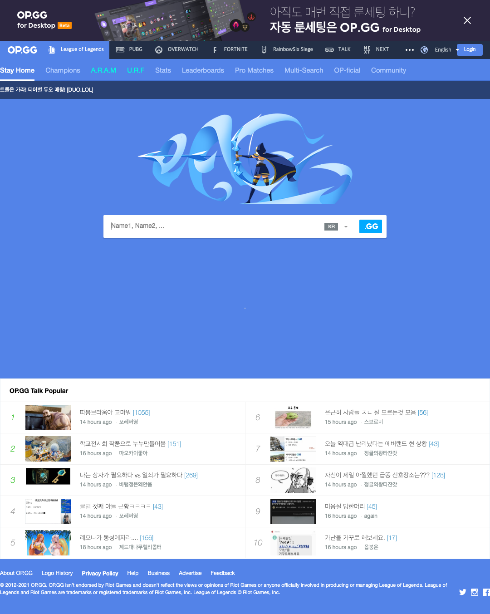
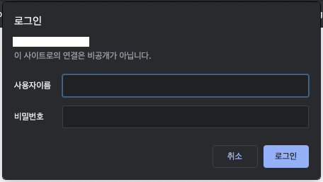
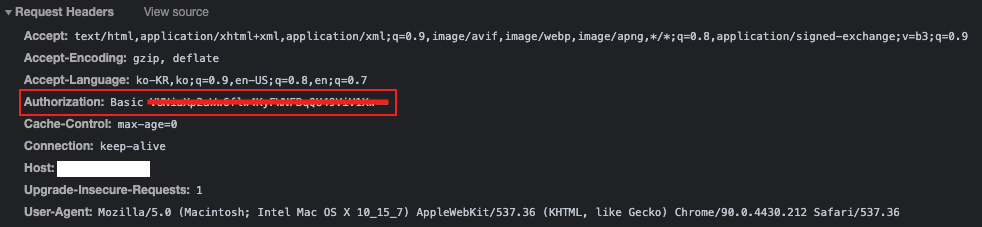

# Screen Capture Scheduler
형님께서 무슨일이신지 특정 URL의 Screen을 Capture하여 주기적으로 특정 사용자들에게 보내야 할 일이 있으니 만들어 달라는 요구사항에 의해 만들게된 레파지토리.

## # Screen Capture
Screen은 `puppeteer` 라는 라이브러리를 사용하여 Capture를 진행한다.  
초기 `Electron`으로 Application으로 만들어 로컬에서 돌릴 수 있게 하려고 하였으나 `Electron` 은 `최소화 상태` 에서 screen 을 capture하지 못해서 그냥 `node` 로 작성한다.  
(사실 방법이야 찾으면 있을 수 있겠으나, 그냥 빠른 방법으로 진행한다. ~~내 휴일이 아깝잖아~~)  

Sample로 테스트 해본 결과 만족스러운 Screen Capture가 나온다.  
``` js
async function capture(url, dst) {
  const browser = await puppeteer.launch();
  const page = await browser.newPage();

  await page.goto(url);

  /* dimensions를 구한 이유는 모든 scroll 영역을 capture하기 위함이다.
  굳이 그럴 필요가 없으면 demensions를 구하고 viewport를 수정할 이유가 없다. */
  const dimensions = await page.evaluate(() => {
    return {
      width: document.documentElement.scrollWidth,
      height: document.documentElement.scrollHeight,
      deviceScaleFactor: window.devicePixelRatio,
    };
  });

  await page.setViewport(dimensions)
  await page.screenshot({ path: dst });
  await browser.close();
}
```

  

## # Mailing
Mailing 은 `nodemailer` 라는 라이브러리를 사용하여 각 사용자에게 mail을 전송한다.

## # 보안 특이사항
1. 요청받은 URL은 Identifier / Password로 인증해야 접근 가능하다.  
     

2. 인증해서 들어가보면 Request Header에 Authorization Basic Token이 들어있다.  
     

3. Basic Token은 Base64로 Encoding 되어있으며 Base64로 Decoding하면 그대로 identifier, password가 노출되는 보안 이슈가 있으며 jwt과 다르게 만료 기한도 없다.   

4. 어찌되었든, 반대로 생각하면 identifier & password를 base64 encoding해서 header에 넣어주면 계속하여 접근이 가능하다.
``` js
const identifier = 'identifier sample';
const password = 'password sample';
const token = Buffer.from(`${identifier}:${password}`, 'utf-8').toString('base64');
const headers = { Authorization: `Basic ${token}` }; // 본 headers를 request에 사용.
```

## # TODO
1. `docker`로 wrapping
2. `strapi`로 mailing 대상 수정할 수 있는 backend 작성
3. ubuntu 환경의 docker 내부에서도 정상적으로 screen capture를 진행하는지 테스트.